### 💻 Computer Science Student | Frontend & Backend Web Developer

- 🎓 Studying at **Hanoi University of Industry**
- 👯 Member of HIT club
- 🌱 Learning **ReactJS (Frontend)** & **Spring Boot (Backend)**
- 📫 Contact: **txt1stparkuor@gmail.com**

---

## 🛠️ Tech Stack

### 💡 Languages & Core

---

### 🎨 Frontend

---

### ⚙️ Backend & Database

-010101?style=flat&logo=socketdotio&logoColor=white)

---

### 🧰 Tools

---

## 📊 GitHub Stats

      
    
  

